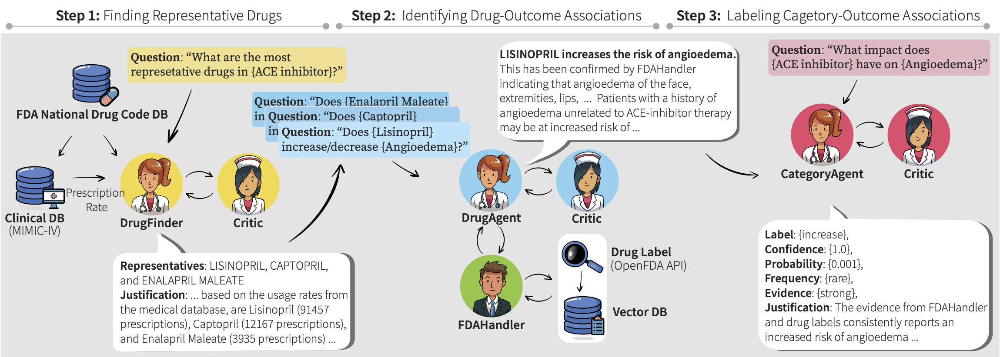

# **MALADE: <u>M</u>ultiple <u>A</u>gents powered by <u>L</u>LMs for <u>ADE</u> Extraction**

[]()
[]()
[](https://opensource.org/licenses/MIT)

## **💊 What is MALADE?**

MALADE (pronounced like the French word <em>malade</em> meaning 'sick' or 'ill') is a framework for the orchestration of LLM-powered agents with Retrieval Augmented Generation (RAG)
for Pharmacovigilance.

<p align="center">
    <br>
    
    <br>    
<p>


## **⚙️ Set up environment and install dependencies**
We leverage the awesome [Langroid](https://github.com/langroid/langroid), the open-source library for multi-agent LLM framework.

IMPORTANT: Please ensure you are using Python 3.11+. If you are using poetry,
you may be able to just run `poetry env use 3.11` if you have Python 3.11 available in your system.

```bash
# clone this repository 
git clone [this-repository]
cd malade
```

Environment setup with conda:
```bash
# create empty environment:
conda env create -n malade python=3.11 -c conda-forge
conda activate malade
```

Setup with venv:
```bash
# create a virtual env under project root, .venv directory
python3 -m venv .venv

# activate the virtual env
. .venv/bin/activate
```

Install dependencies with Poetry:
```bash
# Optionally: poetry lock
poetry install
```

## **🔑 Set up environment variables (API keys, etc)**

To use the example scripts with an OpenAI LLM, you need an OpenAI API Key.
In the root of the repo, copy the `.env-template` file to a new file `.env`:
```bash
cp .env-template .env
```

First, an OpenAI API key is required; set one up [here](https://platform.openai.com/account/api-keys) and store it in `.env` in `OPENAI_API_KEY`.

A Qdrant instance and API key is required (see the [Langroid instructions](https://github.com/langroid/langroid?tab=readme-ov-file#set-up-environment-variables-api-keys-etc)); set up `QDRANT_API_URL` and `QDRANT_API_KEY` in `.env` as described there. 

An OpenFDA API key is also required (get one [here](https://open.fda.gov/apis/authentication/)), store it in `OPENFDA_API_KEY` in `.env`.

### **(Optional) Setup for drug representative generation**

This step is required only to run `DrugFinder` and the drug category representative process.

Make sure that MIMIC-IV is installed and running on your machine as PostgreSQL database.

The MIMIC-IV can be obtained [here](https://physionet.org/content/mimiciv/2.2/#files).
Access requires completing the following training described [here](https://physionet.org/content/mimiciv/view-required-training/2.2/#1).

Instructions and code for loading into PostgreSQL are [here](https://github.com/MIT-LCP/mimic-code/tree/main/mimic-iv/buildmimic/postgres).

Finally, ensure that your user account has access to the `mimiciv` database.


## **🗂️ Code Structure**
We provide brief descriptions for each file as follows:

| Directory/File              | Description                                                                                                                                         |
|-----------------------------|-----------------------------------------------------------------------------------------------------------------------------------------------------|
| malade/                     | core directory for codes                                                                                                                            |
| malade/omop.py              | define the OMOP Ground Truth table, and the associated drug categories and conditions                                                               |
| malade/drug_categories.py   | find representative drugs                                                                                                                           |
| malade/omop_interactions.py | contain `CategoryOutcomeRiskAgent` and `DrugOutcomeInfoAgent` <br/> identify drug-outcome associations and label drug category-outcome associations |
| malade/critic_agent.py      | contain `Critic` and `malade/omop_evaluation.py` <br/> contain utilities for evaluation (for use by `scripts/generate_results.py`)                  |
| malade/doc/                 | contain RAG-related code                                                                                                                            |
| malade/doc/fda_handler.py   | contain `FDAHandler`                                                                                                                                |
| malade/utils/               | for general utilities                                                                                                                               |
| malade/utils/openfda.py     | for the OpenFDA query code                                                                                                                          |
| malade/tools/               | contain utilities related to tool-use                                                                                                               |

### Run Experiments

* STEP1: Finding Representative Drugs (Optional)

If MIMIC-IV was set up, run `DrugFinder` and the drug category representative identification process with
```angular2html
python3 malade/drug_categories.py --recompute
```

* STEP2: Identifying Drug-Outcome Associations 

Run `DrugOutcomeInfoAgent` and the drug-outcome association identification process with
```angular2html
python3 malade/omop_interactions.py --recompute_iteractions
```

* STEP3: Labeling Drug Category-Outcome Associations

Run `CategoryOutcomeRiskAgent` and the category-outcome labeling process with 
```angular2html
python3 malade/omop_interactions.py --recompute_labels
```
Run `python3 scripts/generate_summary_files.py` to process the outputs from MALADE into a readable format.\
`scripts/generate_results.py` contains the code to generate the final experimental results. 

## **🔍 Outputs of MALADE**

The outputs from MALADE are in the `outputs/` directory;

| File                    | Description |
|----------------------------------| -----|
| outputs/representative_drugs.json | outputs from `DrugFinder` |
| outputs/interactions.json        | outputs from `DrugOutcomeInfoAgent` and `CategoryOutcomeRiskAgent` |
| outputs/representative_drugs.md  | outputs in a readable format |
| outputs/omop_results.md          | outputs in a readable format |

The logs generated by the agents are in the `logs/` directory; \
the path is of the form "logs/DrugFinder-{category name}.log" for `DrugFinder`, \
"logs/DrugOutcomeInfoAgent-{outcome}-{drug name}.log" for `DrugOutcomeInfoAgent`, and \
"logs/CategoryOutcomeRiskAgent-{outcome}-{category name}.log" for `CategoryOutcomeRiskAgent`.


## **📎 Reference**

If you find this code/work useful in your own research, please consider citing the following:

```bibtex

```

